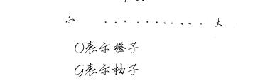
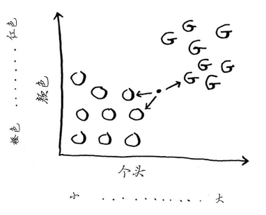

# K最近邻算法（KNN）

## 橙子还是柚子

请看右边的水果，是橙子还是柚子呢？我知道，柚子通常比橙子更大、更红。

我的思维过程类似于这样：我脑子里有个图表。

一般而言，柚子更大、更红。这个水果又大又红，因此很可能是柚子。但下面这样的水果呢？

如果判断这个水果是橙子还是柚子呢？一种办法是看它的邻居。来看看离它最近的三个邻居。

在这三个邻居中，橙子比柚子多，因此这个水果很可能是橙子。祝贺你，你刚才就是使用K最近邻（k-nearest neighbours，KNN）算法进行了分类！这个算法非常简单。

KNN算法虽然简单却很有用！要对东西进行分类时，可首先尝试这种算法。下面来看一更真实的例子。

## 创建推荐系统

假设你是Netflix，要为用户创建一个电影推荐系统。从本质上说，这类似于前面的水果问题！

你可以将所有用户都放入一个图表中。

这些用户在图表中的位置取决于其喜好，因此喜好相似的用户距离较近。假设你要向Priyanka推荐电影，可以找出五位与他最接近的用户。

假设在对电影的喜好方面，Justin、JC、Joey、Lance和Chris都与Priyanka差不多，因此他们喜欢的电影很可能Priyanka也喜欢！

有了这样的图表以后，创建推荐系统就将易如反掌：只要是Justin喜欢的电影，就将其推荐给Priyanka。

但还有一个重要的问题没有解决。在前面的图表中，相似的用户相距较近，但如何确定两位用户的相似程度呢？

### 特征提取

在前面的水果示例中，你根据个头和颜色来比较水果，换言之，你比较的特征是个头和颜色。现在假设有三个水果，你可抽取它们的特征。

再根据这些特征绘图。

从上图可知，水果A和B比较像。下面来度量它们有多像。要计算两点的距离，可使用毕达哥拉斯公式。

例如，A和B的距离如下。

A和B的距离为1。你还可计算其他水果之间的距离。

这个距离公式印证了你的直觉：A和B很像。

假设你要比较的是Netflix用户，就需要以某种方式将他们放到图表中。因此，你需要将每位用户都转换为一组坐标，就像前面对水果所做的那样。

在能够将用户放入图表后，你就可以计算他们之间的距离了。

下面是一种将用户转换为一组数字的方式。用户注册时，要求他们指出对各种电影的喜欢程度。这样，对于每位用户，都将获得一组数字！

Priyanka和Justin都喜欢爱情片且都讨厌恐怖片。Morpheus喜欢动作片，但讨厌爱情片（他讨厌好好的动作电影毁于浪漫的桥段）。前面判断水果是橙子还是柚子时，每种水果都用2个数字表示，你还记得吗？在这里，每位用户都用5个数字表示。

在数学家看来，这里计算的是五维（而不是二维）空间中的距离，但计算公式不变。

这个公式包含5个而不是2个数字。

这个距离公式很灵活，即便涉及很多个数字，依然可以使用它来计算距离。你可能会问，涉及5个数字时，距离意味着什么呢？这种距离指出了两组数字之间的相似程度。

这是Priyanka和Justin的距离。

Priyanka和Justin很像。Priyanka和Morpheus的差别有多大呢？请计算他们之间的距离，再接着往下读。

Priyanka和Morpheus的距离为24，你算对了吗？上述距离表明，Priyanka的喜好更接近于Justin而不是Morpheus。

太好了！现在要向Priyanka推荐电影将易如反掌：只要是Justin喜欢的电影，就将其推荐给Priyanka，反之亦然。你这就创建了一个电影推荐系统！

如果你是Netflix用户，Netflix将不断提醒你：多给电影评分吧，你评论的电影越多，给你的推荐就越准确。现在你明白了其中的原因：你评论的电影越多，Netflix就越能准确地判断出你与哪些用户类似。

### 回归

假设你不仅要向Priyanka推荐电影，还要预测她将给这部电影打多少分。为此，先找出与她最近的5个人。

顺便说一句，我老说最近的5个人，其实并非一定要选择5个最近的邻居，也可选择2个、10个或10 000个。这就是这种算法名为K最近邻而不是5最近邻的原因！

假设你要预测Priyanka会给电影Pitch Perfect打多少分。Justin、JC、Joey、Lance和Chris都给它打了多少分呢？

你求这些人打的分的平均值，结果为4.2。这就是回归（regression）。你将使用KNN来做两项基本工作——分类和回归：
- 分类就是编组；
- 回归就是预测结果（如一个数字）。

回归很有用。假设你在伯克利开个小小的面包店，每天都做新鲜面包，需要根据如下一组特征预测当天该烤多少条面包：

- 天气指数1～5（1表示天气很糟，5表示天气非常好）；
- 是不是周末或节假日（周末或节假日为1，否则为0）；
- 有没有活动（1表示有，0表示没有）。
- 
你还有一些历史数据，记录了在各种不同的日子里售出的面包数量。

今天是周末，天气不错。根据这些数据，预测你今天能售出多少条面包呢？我们来使用KNN算法，其中的K为4。首先，找出与今天最接近的4个邻居。

距离如下，因此最近的邻居为A、B、D和E。

将这些天售出的面包数平均，结果为218.75。这就是你今天要烤的面包数！

> 余弦相似度
> 
> 前面计算两位用户的距离时，使用的都是距离公式。还有更合适的公式吗？在实际工作中，经常使用余弦相似度（cosine similarity）。假设有两位品味类似的用户，但其中一位打分时更保守。他们都很喜欢Manmohan Desai的电影Amar Akbar Anthony，但Paul给了5星，而Rowan只给4星。如果你使用距离公式，这两位用户可能不是邻居，虽然他们的品味非常接近。
> 
> 余弦相似度不计算两个矢量的距离，而比较它们的角度，因此更适合处理前面所说的情况。
> 此处不讨论余弦相似度，但如果你要使用KNN，就一定要研究研究它！

###　挑选合适的特征

为推荐电影，你让用户指出他对各类电影的喜好程度。如果你是让用户给一系列小猫图片打分呢？在这种情况下，你找出的是对小猫图片的欣赏品味类似的用户。对电影推荐系统来说，这很可能是一个糟糕的推荐引擎，因为你选择的特征与电影欣赏品味没多大关系。

又假设你只让用户给《玩具总动员》《玩具总动员2》和《玩具总动员3》打分。这将难以让用户的电影欣赏品味显现出来！使用KNN时，挑选合适的特征进行比较至关重要。所谓合适的特征，就是：
- 与要推荐的电影紧密相关的特征；
- 不偏不倚的特征（例如，如果只让用户给喜剧片打分，就无法判断他们是否喜欢动作片）。

你认为评分是不错的电影推荐指标吗？我给The Wire的评分可能比House Hunters高，但实际上我观看House Hunters的时间更长。该如何改进Netflix的推荐系统呢？

回到面包店的例子：对于面包店，你能找出两个不错和糟糕的特征吗？在报纸上打广告后，你可能需要烤制更多的面包；或者每周一你都需要烤制更多的面包。

在挑选合适的特征方面，没有放之四海皆准的法则，你必须考虑到各种需要考虑的因素。

## 机器学习简介

KNN算法真的是很有用，堪称你进入神奇的机器学习领域的领路人！机器学习旨在让计算机更聪明。你见过一个机器学习的例子：创建推荐系统。下面再来看看其他一些例子。

### OCR

OCR指的是光学字符识别（optical character recognition），这意味着你可拍摄印刷页面的照片，计算机将自动识别出其中的文字。Google使用OCR来实现图书数字化。OCR是如何工作的呢？我们来看一个例子。请看下面的数字。

如何自动识别出这个数字是什么呢？可使用KNN。
1. 浏览大量的数字图像，将这些数字的特征提取出来。
2. 遇到新图像时，你提取该图像的特征，再找出它最近的邻居都是谁！
这与前面判断水果是橙子还是柚子时一样。一般而言，OCR算法提取线段、点和曲线等特征。

遇到新字符时，可从中提取同样的特征。

与前面的水果示例相比，OCR中的特征提取要复杂得多，但再复杂的技术也是基于KNN等
简单理念的。这些理念也可用于语音识别和人脸识别。你将照片上传到Facebook时，它有时候能够自动标出照片中的人物，这是机器学习在发挥作用！

OCR的第一步是查看大量的数字图像并提取特征，这被称为训练（training）。大多数机器学习算法都包含训练的步骤：要让计算机完成任务，必须先训练它。下一个示例是垃圾邮件过滤器，其中也包含训练的步骤。

### 垃圾邮件过滤器

垃圾邮件过滤器使用一种简单算法——朴素贝叶斯分类器（Naive Bayes classifier），你首先需要使用一些数据对这个分类器进行训练。

假设你收到一封主题为“collect your million dollars now!”的邮件，这是垃圾邮件吗？你可研究这个句子中的每个单词，看看它在垃圾邮件中出现的概率是多少。例如，使用这个非常简单的模型时，发现只有单词million在垃圾邮件中出现过。朴素贝叶斯分类器能计算出邮件为垃圾邮件的概率，其应用领域与KNN相似。

例如，你可使用朴素贝叶斯分类器来对水果进行分类：假设有一个又大又红的水果，它是柚子的概率是多少呢？朴素贝叶斯分类器也是一种简单而极其有效的算法。我们钟爱这样的算法！

## 结语

但愿通过阅读本章，你对KNN和机器学习的各种用途能有大致的认识！机器学习是个很有趣的领域，只要下定决心，你就能很深入地了解它。

- KNN用于分类和回归，需要考虑最近的邻居。
- 分类就是编组。
- 回归就是预测结果（如数字）。
- 特征抽取意味着将物品（如水果或用户）转换为一系列可比较的数字。
- 能否挑选合适的特征事关KNN算法的成败。

**图文来源：《算法图解》Aditya Bhargava著　袁国忠译**