# 排序算法

记录了10种常见的排序算法原理及实现代码

排序算法是《数据结构与算法》中最基本的算法之一。

排序算法可以分为内部排序和外部排序。

内部排序是数据记录在内存中进行排序。

而外部排序是因排序的数据很大，一次不能容纳全部的排序记录，在排序过程中需要访问外存。

常见的内部排序算法有：插入排序、希尔排序、选择排序、冒泡排序、归并排序、快速排序、堆排序、基数排序等。


| 排序算法 | 平均时间复杂度 | 最好时间复杂度 | 最坏时间复杂度 | 空间复杂度 | 稳定性 |
| :-----: | :---------: | :----------: | :--: | :--: | :--: |
| 插入排序 |    O(n^2)    |    O(n)     | O(n^2)   | O(1)   | 稳定   |
| 希尔排序 |   O(nlogn)   |  O(nlog^2n)   | O(nlog^2n)   | O(1)   | 不稳定   |
| 选择排序 |    O(n^2)    |   O(n^2)   | O(n^2)   | O(1)   | 不稳定   |
|  堆排序  |   O(nlogn)   |   O(nlogn)   | O(nlogn)   | O(1)   | 不稳定   |
| 冒泡排序 |    O(n^2)    |   O(n)   | O(n^2)   | O(1)   | 稳定   |
| 快速排序 |   O(nlogn)   |   O(nlogn)   | O(n^2)   | O(nlogn)   | 不稳定   |
| 计数排序 |    O(n+k)    |   O(n+k)   | O(n+k)   | O(k)   | 稳定   |
|  桶排序  |    O(n+k)    |   O(n+k)   | O(n^2)   | O(n+k)   | 稳定   |
| 基数排序 |    O(n*k)    |   O(n*k)   | O(n*k)   | O(n+k)   | 稳定   |
| 归并排序 |   O(nlogn)   |   O(nlogn)   | O(nlogn)   | O(n)   | 稳定   |

关于时间复杂度：
1. 平方阶 (O(n2)) 排序 各类简单排序：直接插入、直接选择和冒泡排序。
2. 线性对数阶 (O(nlog2n)) 排序 快速排序、堆排序和归并排序；
3. O(n1+§)) 排序，§ 是介于 0 和 1 之间的常数。 希尔排序
4. 线性阶 (O(n)) 排序 基数排序，此外还有桶、箱排序。

关于稳定性：
1. 稳定的排序算法：冒泡排序、插入排序、归并排序和基数排序。
2. 不是稳定的排序算法：选择排序、快速排序、希尔排序、堆排序。

## 目录

* [前言](#排序算法)
* [插入排序](#插入排序)
  * [直接插入排序](#直接插入排序)
  * [希尔排序](#希尔排序)
* [选择排序](#选择排序)
  * [直接选择排序](#直接选择排序)
  * [堆排序](#堆排序)
* [交换排序](#交换排序)
  * [冒泡排序](#冒泡排序)
  * [快速排序](#快速排序)
* [分区排序](#分区排序)
  * [计数排序](#计数排序)
  * [桶排序](#桶排序)
* [基数排序](#基数排序)
* [归并排序](#归并排序)
* [各算法适用场景](#各算法适用场景)
  * [插入/希尔/选择/冒泡排序](###插入/希尔/选择/冒泡排序)
  * [快速/堆/计数排序](###快速/堆/计数排序)
  * [桶/计数排序](###桶/计数排序)
## 插入排序

**[插入排序的基本思想]** 从初始有序的子集合开始，不断地把新的数据元素插入到已排列有序子集合的合适位置，使子集合中数据元素的个数不断增多，当子集合等于集合时，插入排序算法结束。常用的插入排序有直接插入排序和希尔排序两种。

### 直接插入排序

**[直接插入排序的基本思想]** 顺序地把待排序的数据元素按其关键字值的大小插入到已排序数据元素子集合的适当位置。子集合的数据元素个数从只有一个数据元素开始，逐次增大，当子集合大小最终和集合大小相同时，排序完毕。

#### 算法步骤

1. 将第一待排序序列第一个元素看做一个有序序列，把第二个元素到最后一个元素当成是未排序序列。
2. 从头到尾依次扫描未排序序列，将扫描到的每个元素插入有序序列的适当位置。（如果待插入的元素与有序序列中的某个元素相等，则将待插入元素插入到相等元素的后面。

#### 演示


#### 流程图

<div align=center>

</div>

#### 代码实现

```python
def insertSort(arr):
    for i in range(len(arr)-1):
        temp = arr[i+1]
        j = i
        while j > -1 and temp < arr[j]:
            arr[j+1] = arr[j]
            j -= 1
        arr[j+1] = temp
    return arr
```


### 希尔排序

**[希尔排序的基本思想]**  把待排序的数据元素分成若千个小组，对同一小组内的数据元素用直接插入法排序;小组的个数逐次减少; 当完成了所有数据元素都在一个组内的排序后，排序过程结束。希尔排序又称作缩小增量排序。

希尔排序，也称递减增量排序算法，是插入排序的一种更高效的改进版本。但希尔排序是非稳定排序算法。

希尔排序是基于插入排序的以下两点性质而提出改进方法的：

1. 插入排序在对几乎已经排好序的数据操作时，效率高，即可以达到线性排序的效率；
2. 但插入排序一般来说是低效的，因为插入排序每次只能将数据移动一位；

#### 算法步骤

1. 选择一个增量序列 t1，t2，……，tk，其中 ti > tj, tk = 1；
2. 按增量序列个数 k，对序列进行 k 趟排序；
3. 每趟排序，根据对应的增量 ti，将待排序列分割成若干长度为 m 的子序列，分别对各子表进行直接插入排序。仅增量因子为 1 时，整个序列作为一个表来处理，表长度即为整个序列的长度。

#### 演示


#### 流程图

<div align=center>

</div>

#### 代码实现

```python
def shellSort(arr):
    gap = 1
    while (gap < len(arr)/3):
        gap = gap * 3 + 1
        while gap > 0:
            for i in range(gap, len(arr)):
                temp = arr[i]
                j = i - gap
                while j >= 0 and arr[j] > temp:
                    arr[j+gap] = arr[j]
                    j -= gap
                arr[j+gap] = temp
            gap = int(gap/3)
        return arr
```

## 选择排序

**[选择排序的基本思想]** 每次从待排序的数据元素集合中选取关键字最小(或最大)的数据元素放到数据元素集合的最前面(或最后面)，数据元素集合不断缩小，当数据元素集合为空

### 直接选择排序

**[直接选择排序的基本思想]** 从待排序的数据元素集合中选取关键字最小的数据元素并将它与原始数据元素集合中的第1个数据元素交换位置；然后从不包括第2个位置上数据元素的集合中选取关键字最小的数据元素，并将它与原始数据元素集合中的第3个数据元素交换位置:如此重复，直到数据元素集合中只剩一个数据元素为止。

#### 算法步骤

1. 首先在未排序序列中找到最小（大）元素，存放到排序序列的起始位置
2. 再从剩余未排序元素中继续寻找最小（大）元素，然后放到已排序序列的末尾。
3. 重复第二步，直到所有元素均排序完毕。

#### 演示


#### 流程图

<div align=center>

</div>

#### 代码实现

```python
def selectSort(arr):
    new_arr = []
    for i in range(len(arr)):
        temp = arr[0]
        smallest = 0
        for i in range(1, len(arr)):
            if arr[i] < temp:
                temp = arr[i]
                smallest = i
        new_arr.append(arr.pop(smallest))
    return new_arr
```

### 堆排序

在直接选择排序中，待排序的数据元素集合构成一个线性结构，要从有n个数据元素的线性结构中选择出一个最小的数据元素需要比较n-1次。如果能把待排序的数据元素集合构成一个完全二叉树结构，则每次选择出一个最大(或最小)的数据元素只需要比较完全二叉树的深度次，即1bn次，则排序算法的时间复杂度就是O(nlbn)。这就是堆排序的基本思想。

堆排序（Heapsort）是指利用堆这种数据结构所设计的一种排序算法。堆积是一个近似完全二叉树的结构，并同时满足堆积的性质：即子结点的键值或索引总是小于（或者大于）它的父节点。堆排序可以说是一种利用堆的概念来排序的选择排序。分为两种方法：

- 大顶堆：每个节点的值都大于或等于其子节点的值，在堆排序算法中用于升序排列；
- 小顶堆：每个节点的值都小于或等于其子节点的值，在堆排序算法中用于降序排列；

堆排序的平均时间复杂度为 Ο(nlogn)。

**[堆排序的基本思想]** 首先把有n个元素的数组a初始化创建为最大堆，然后循环执行如下过程直到数组为空为止:
1. 把堆顶a[0]元素(为最大元素)和当前最大堆的最后一个元素交换
2. 最大堆元素个数减1
3. 由于第①步后根结点不再满足最大堆的定义，因此调整根结点使之满足最大堆的定义

#### 算法步骤

1. 创建一个堆 H[0……n-1]；
2. 把堆首（最大值）和堆尾互换；
3. 把堆的尺寸缩小 1，并调用 shift_down(0)，目的是把新的数组顶端数据调整到相应位置；
4. 重复步骤 2，直到堆的尺寸为 1。

#### 演示


#### 流程图

<div align=center>

</div>

#### 代码实现

```python
# coding:utf-8

def buildMaxHeap(arr):
    # 遍历所有非叶节点
    for i in range(int(len(arr)/2), -1, -1):
        heapify(arr, i)

def heapify(arr, i):
    # 非叶结点arr[i]的左右结点下标
    left = 2*i + 1
    right = 2*i + 2
    largest = i
    # 如果子结点比该非叶结点大，则将二者换位
    if left < arrLen and arr[left] > arr[largest]:
        largest = left
    if right < arrLen and arr[right] > arr[largest]:
        largest = right

    if largest != i:
        swap(arr, i, largest)
        heapify(arr, largest)

def swap(arr, i, j):
    # 换位
    arr[i], arr[j] = arr[j], arr[i]

def heapSort(arr):
    # 全局变量，保存原数组的长度
    global arrLen
    arrLen = len(arr)
    buildMaxHeap(arr)
    for i in range(len(arr)-1, 0, -1):
        swap(arr, 0, i)
        arrLen -= 1 
        heapify(arr, 0)
    return arr
```

## 交换排序

利用交换数据元素的位置进行排序的方法称作**交换排序**。常用的交换排序方法有冒泡排序法和快速排序法。快速排序是一种分区交换排序方法。

### 冒泡排序

#### 算法步骤

1. 比较相邻的元素。如果第一个比第二个大，就交换他们两个。
2. 对每一对相邻元素作同样的工作，从开始第一对到结尾的最后一对。这步做完后，最后的元素会是最大的数。
3. 针对所有的元素重复以上的步骤，除了最后一个。
4. 持续每次对越来越少的元素重复上面的步骤，直到没有任何一对数字需要比较。

#### 演示


#### 流程图

<div align=center>

</div>

#### 代码实现

```python
# 冒泡排序
def bubbleSort(array):
    arr = array
    for i in range(1, len(arr)):
        flag = True
        for j in range(0, len(arr)-i):
            if arr[j] > arr[j+1]:
                tmp = arr[j]
                arr[j] = arr[j+1]
                arr[j+1] = tmp
                flag = False  
        if flag:
            break
    return arr
```

### 快速排序

快速排序是由东尼·霍尔所发展的一种排序算法。在平均状况下，排序 n 个项目要 Ο(nlogn) 次比较。在最坏状况下则需要 Ο(n2) 次比较，但这种状况并不常见。事实上，快速排序通常明显比其他 Ο(nlogn) 算法更快，因为它的内部循环（inner loop）可以在大部分的架构上很有效率地被实现出来。

快速排序使用分治法（Divide and conquer）策略来把一个串行（list）分为两个子串行（sub-lists）。

快速排序又是一种分而治之思想在排序算法上的典型应用。本质上来看，快速排序应该算是在冒泡排序基础上的递归分治法。

#### 算法步骤

1. 从数列中挑出一个元素，称为 “基准”（pivot）;
2. 重新排序数列，所有元素比基准值小的摆放在基准前面，所有元素比基准值大的摆在基准的后面（相同的数可以到任一边）。在这个分区退出之后，该基准就处于数列的中间位置。这个称为分区（partition）操作；
3. 递归地（recursive）把小于基准值元素的子数列和大于基准值元素的子数列排序；

递归的最底部情形，是数列的大小是零或一，也就是永远都已经被排序好了。虽然一直递归下去，但是这个算法总会退出，因为在每次的迭代（iteration）中，它至少会把一个元素摆到它最后的位置去

#### 演示


#### 流程图

<div align=center>

</div>

#### 代码实现

```python
# 快速排序
def quicksort(array):
    if len(array) < 2:
        # 基线条件：为空或只包含一个元素的数组是“有序”的
        return array
    else:
        # 递归条件
        pivot = array[0]
        # 由所有小于基准线的元素组成的子数组
        less = [i for i in array[1:] if i <= pivot]
        # 由所有大于基准线的元素组成的子数组
        greater = [i for i in array[1:] if i > pivot]
        return quicksort(less) + [pivot] + quicksort(greater)
```

## 分区排序

### 计数排序

计数排序是一种非基于比较的排序算法，其空间复杂度和时间复杂度均为O(n+k)，其中k是整数的范围。基于比较的排序算法时间复杂度最小是O(nlogn)的。该算法于1954年由 Harold H. Seward 提出。

计数排序的核心在于将输入的数据值转化为键存储在额外开辟的数组空间中。作为一种线性时间复杂度的排序，计数排序要求输入的数据必须是有确定范围的整数。

#### 算法步骤

1. 花O(n)的时间扫描一下整个序列 A，获取最小值 min 和最大值 max
2. 开辟一块新的空间创建新的数组 B，长度为 ( max - min + 1)
3. 数组 B 中 index 的元素记录的值是 A 中某元素出现的次数
4. 最后输出目标整数序列，具体的逻辑是遍历数组 B，输出相应元素以及对应的个数

#### 演示


#### 流程图

<div align=center>

</div>

#### 代码实现

```python
# 计数排序
def countingSort(arr, maxValue):
    bucketLen = maxValue + 1
    bucket = [0] * bucketLen
    sortedIndex = 0
    arrLen = len(arr)
    for i in range(arrLen):
        if not bucket[arr[i]]:
            bucket[arr[i]] = 0
        bucket[arr[i]] += 1
    for j in range(bucketLen):
        while bucket[j] > 0:
            arr[sortedIndex] = j
            sortedIndex += 1
            bucket[j] -= 1
    return arr
```

### 桶排序

桶排序(Bucket sort)是一种基于计数的排序算法（计数排序可参考上节的内容），工作的原理是将数据分到有限数量的桶子里，然后每个桶再分别排序（有可能再使用别的排序算法或是以递回方式继续使用桶排序进行排序）

#### 算法步骤

1. 设置固定数量的空桶。
2. 把数据放到对应的桶中。
3. 对每个不为空的桶中数据进行排序。
4. 拼接不为空的桶中数据，得到结果。

#### 演示


#### 流程图

<div align=center>

</div>

#### 代码实现
```python
def bucketSort(array):
    n = len(array)
    # 1.创建n个空桶
    new_list = [[] for _ in range(n)]
    # 2.把arr[i] 插入到bucket[n*array[i]]
    for data in array:
        index = int(data * n)
        new_list[index].append(data)
    # 3.桶内排序
    for i in range(n):
        new_list[i].sort()
    # 4.产生新的排序后的列表
    index = 0
    for i in range(n):
        for j in range(len(new_list[i])):
            array[index] = new_list[i][j]
            index += 1
    return array
```

## 基数排序

基数排序 (Radix Sort) 是一种非比较型整数排序算法，其原理是将整数按位数切割成不同的数字，然后按每个位数分别比较。基数排序的发明可以追溯到 1887 年赫尔曼·何乐礼在打孔卡片制表机 (Tabulation Machine)上的贡献。

基数排序法会使用到桶 (Bucket)，顾名思义，通过将要比较的位（个位、十位、百位…），将要排序的元素分配至 0~9 个桶中，借以达到排序的作用，在某些时候，基数排序法的效率高于其它的比较性排序法。

#### 算法步骤

1. 将所有待比较数值（正整数）统一为同样的数位长度，数位较短的数前面补零
2. 从最低位开始，依次进行一次排序
3. 从最低位排序一直到最高位排序完成以后, 数列就变成一个有序序列

#### 演示


#### 流程图

<div align=center>

</div>

#### 代码实现

```python
#! /usr/bin/env python
#coding=utf-8

#基于桶排序的基数排序
from random import randint

def RadixSort(list,d):    
    for k in xrange(d):#d轮排序
        s=[[] for i in xrange(10)]#因为每一位数字都是0~9，故建立10个桶
        '''对于数组中的元素，首先按照最低有效数字进行
           排序，然后由低位向高位进行。'''
        for i in list:
            '''对于3个元素的数组[977, 87, 960]，第一轮排序首先按照个位数字相同的
               放在一个桶s[7]=[977],s[7]=[977,87],s[0]=[960]
               执行后list=[960,977,87].第二轮按照十位数，s[6]=[960],s[7]=[977]
               s[8]=[87],执行后list=[960,977,87].第三轮按照百位，s[9]=[960]
               s[9]=[960,977],s[0]=87,执行后list=[87,960,977],结束。'''
            s[i/(10**k)%10].append(i) #977/10=97(小数舍去),87/100=0
        list=[j for i in s for j in i]
    return list

if __name__ == '__main__':
    a=[randint(1,999) for i in xrange(10)]#最多是三位数，因此d=3
    print a
    a=RadixSort(a,3)#将排好序的数组再赋给a!!!!
    print a
```

## 归并排序

归并排序（Merge sort）是建立在归并操作上的一种有效的排序算法。该算法是采用分治法（Divide and Conquer）的一个非常典型的应用。

作为一种典型的分而治之思想的算法应用，归并排序的实现由两种方法：

1. 自上而下的递归（所有递归的方法都可以用迭代重写，所以就有了第 2 种方法）；
2. 自下而上的迭代；

和选择排序一样，归并排序的性能不受输入数据的影响，但表现比选择排序好的多，因为始终都是 O(nlogn) 的时间复杂度。代价是需要额外的内存空间。

#### 算法步骤

1. 申请空间，使其大小为两个已经排序序列之和，该空间用来存放合并后的序列；
2. 设定两个指针，最初位置分别为两个已经排序序列的起始位置；
3. 比较两个指针所指向的元素，选择相对小的元素放入到合并空间，并移动指针到下一位置；
4. 重复步骤 3 直到某一指针达到序列尾；
5. 将另一序列剩下的所有元素直接复制到合并序列尾。

#### 演示


#### 流程图

<div align=center>

</div>

#### 代码实现

```python
def mergeSort(arr):
    if len(arr) < 2:
        return arr
    middle = int(len(arr)/2)
    left, right = arr[0:middle], arr[middle:]
    return merge(mergeSort(left), mergeSort(right))

def merge(left, right):
    result = []
    while left and right:
        if left[0] <= right[0]:
            result.append(left.pop(0))
        else:
            result.append(right.pop(0))
    while left:
        result.append(left.pop(0))
    while right:
        result.append(right.pop(0))
    return result
```

## 各算法适用场景


### 插入/希尔/选择/冒泡排序


**插入排序** ：是对已经存在的一个有序的数据序列，在这个已经排好的数据序列中插入一个数，这个时候用插入排序比较好，适用于输入规模n比较小的时候，和序列基本有序的时候，有序部分越大越好。

**希尔排序** ：是直接插入排序算法的一种更高效的改进版本，希尔排序的比较次数和移动次数都要比直接插入排序少，当N越大时，效果越明显。

**选择排序** ：适用于大多数排序场景，虽然他的对比次数较多，但是数据量大的时候，他的效率明显优于冒泡，而且数据移动是非常耗时的，选择排序移动次数少。适用于输入规模n比较小的时候。（插入排序通常会比选择排序少一些比较的次数，但是选择排序会比插入排序少挪动的次数）

**冒泡排序** ：当数组基本有序的情况下适合使用冒泡排序，它在基本有序的情况下排序的时间复杂度接近O(n)

当n较大，要求速度较快的时候可以使用nlogn的算法比如：堆排序、快速排序和归并排序。堆排序的空间复杂度为O(1)、而快速排序的空间复杂度是O(logn)(递归使用栈的情况)，而归并排序的时间复杂度最大是O(n).

### 快速/堆/计数排序

**快速排序** ：快速排序是目前基于比较的排序中被认为是最好的方法，当待排序的关键字是随机分布时，快速排序的平均时间最短；C语言标准库中的函数 qsort实现的就是快速排序

**堆排序** ：堆排序所需的辅助空间少于快速排序，并且不会出现快速排序可能出现的最坏情况。这两种排序都是不稳定的。

堆排序比较和交换次数比快速排序多，所以平均而言比快速排序慢，如果你需要的是“排序”，那么绝大多数场合都应该用快速排序而不是其它的O(nlogn)算法。

但有时候你要的不是“排序”，而是另外一些与排序相关的东西，比如最大/小的元素，topK(从海量数据中找到第K大/小的数)之类，这时候堆排序的优势就出来了。用堆排序可以在N个元素中找到top K，时间复杂度是O(N log K)，空间复杂的是O(K)，而快速排序的空间复杂度是O(N)，也就是说，如果你要在很多元素中找很少几个top K的元素，或者在一个巨大的数据流里找到top K，快速排序是不合适的，堆排序更省地方。

另外一个适合用堆排序的场合是优先队列，需要在一组不停更新的数据中不停地找最大/小元素。

**计数排序**虽说也是O(nlogn)，但一般都只在一些很特殊的场合才会用，比如N-way merge，可以把N个已经排好序的数据流合并成一个排好序的数据流，当然这个算法其实严格说并不能算是merge sort，只是用了其中的几个步骤，不过思路是一样的。“总数大，范围小”的情况下比较适合计数排序。

### 桶/计数排序

当范围已经知道，而且空间不是很重要的情况下使用**桶排序**。桶排序，其优势在于处理大数据量的排序场景，数据相对比较集中，这样性能优势很明显。这个快，应该是建立在大数据量的排序。若待排序的数据元素个数比较少，桶排序的优势就不是那么明显了，因为桶排序就是基于分而治之的策略，可以将数据进行分布式排序，充分发挥并行计算的优势。

对于**基数排序**，最直观的要求就是数据无符号，且可以分解。