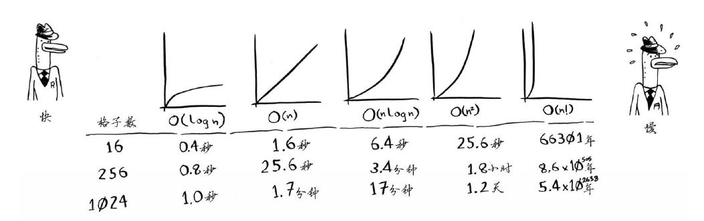
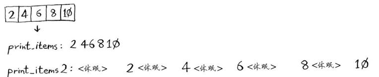
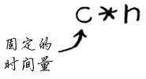
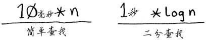
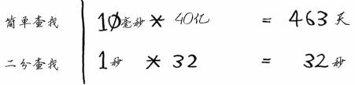
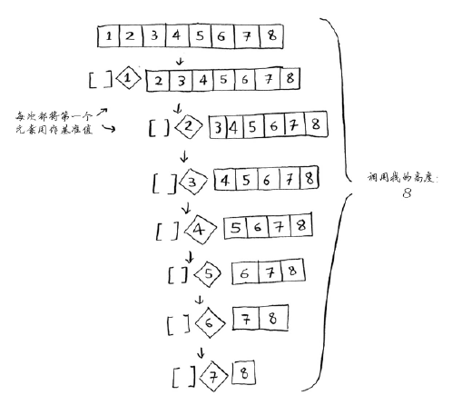
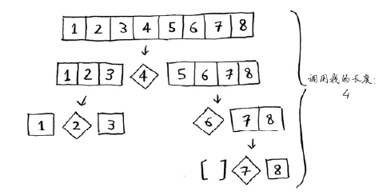
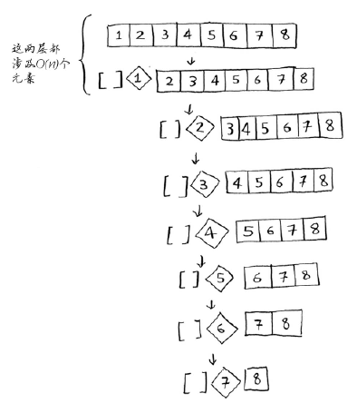
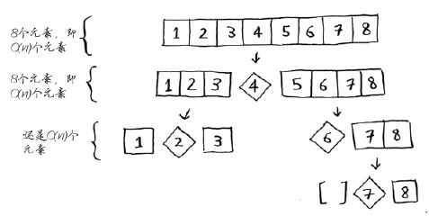
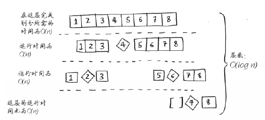

# 大O表示法（复杂度的计算）

## 算法的运行时间以不同的速度增加

大O表示法指出了算法有多快。例如，假设列表包含n个元素。简单查找需要检查每个元素，因此需要执行n次操作。
使用大O表示法，这个运行时间为O(n)。单位秒呢？没有——大O表示法指的并非以秒为单位的速度。
**大O表示法让你能够比较操作数，它指出了算法运行时间的增速。**

再来看一个例子。为检查长度为n的列表，二分查找需要执行log n次操作。使用大O表示法，
这个运行时间怎么表示呢？O(log n)。一般而言，大O表示法像下面这样。

<div align=center>

.png)

</div>
这指出了算法需要执行的操作数。之所以称为大O表示法，是因为操作数前有个大O。这听起来像笑话，但事实如此！

## 大O 表示法指出了最糟情况下的运行时间

假设你使用简单查找在电话簿中找人。你知道，简单查找的运行时间为O(n)，这意味着在最
糟情况下，必须查看电话簿中的每个条目。如果要查找的是Adit——电话簿中的第一个人，一次
就能找到，无需查看每个条目。考虑到一次就找到了Adit，请问这种算法的运行时间是O(n)还是O(1)呢？

简单查找的运行时间总是为O(n)。查找Adit时，一次就找到了，这是最佳的情形，但大O表
示法说的是最糟的情形。因此，你可以说，在最糟情况下，必须查看电话簿中的每个条目，对应
的运行时间为O(n)。这是一个保证——你知道简单查找的运行时间不可能超过O(n)。

## 一些常见的大O 运行时间

下面按从快到慢的顺序列出了你经常会遇到的5种大O运行时间。
- O(log n)，也叫对数时间，这样的算法包括二分查找。
- O(n)，也叫线性时间，这样的算法包括简单查找。
- O(n * log n)，这样的算法包括第4章将介绍的快速排序——一种速度较快的排序算法。
- O(n2 )，这样的算法包括第2章将介绍的选择排序——一种速度较慢的排序算法。
- O(n!)，这样的算法包括接下来将介绍的旅行商问题的解决方案——一种非常慢的算法。

下面按从快到慢的顺序列出了使用这些算法绘制网格所需的时间：

<div align=center>



</div>

这里做了简化，实际上，并不能如此干净利索地将大O运行时间转换为操作数，但就目前而
言，这种准确度足够了。当前，我们获得的主要启示如下。
1. 算法的速度指的并非时间，而是操作数的增速。
2. 谈论算法的速度时，我们说的是随着输入的增加，其运行时间将以什么样的速度增加。
3. 算法的运行时间用大O表示法表示。
4. O(log n)比O(n)快，当需要搜索的元素越多时，前者比后者快得越多。

## 大O表示法中不带常量

假设有下面这样打印列表中每个元素的简单函数。

```python
def print_items(list):
for item in list:
print item
```

这个函数遍历列表中的每个元素并将其打印出来。它迭代整个列表一次，因此运行时间为O(n)。现在假设你对这个函数进行修改，使其在打印每个元素前都休眠1秒钟。
```python
from time import sleep
def print_items2(list):
for item in list:
sleep(1)
print item
```
它在打印每个元素前都暂停1秒钟。假设你使用这两个函数来打印一个包含5个元素的列表。

<div align="center">



</div>

这两个函数都迭代整个列表一次，因此它们的运行时间都为O(n)。你认为哪个函数的速度更快呢？我认为print_items要快得多，因为它没有在每次打印元素前都暂停1秒钟。因此，虽然使用大O表示法表示时，这两个函数的速度相同，但实际上print_items的速度更快。在大O表示法O(n)中，n实际上指的是这样的。

<div align="center">



</div>

c是算法所需的固定时间量，被称为常量。例如，print_ items所需的时间可能是10毫秒*n，
而print_items2所需的时间为1秒* n。

通常不考虑这个常量，因为如果两种算法的大O运行时间不同，这种常量将无关紧要。就拿二分查找和简单查找来举例说明。假设这两种算法的运行时间包含如下常量。

<div align="center">



</div>

你可能认为，简单查找的常量为10毫秒，而二分查找的常量为1秒，因此简单查找的速度要快得多。现在假设你要在包含40亿个元素的列表中查找，所需时间将如下。

<div align="center">



</div>

正如你看到的，二分查找的速度还是快得多，常量根本没有什么影响。

但有时候，常量的影响可能很大，对快速查找和合并查找来说就是如此。快速查找的常量比合并查找小，因此如果它们的运行时间都为O(n log n)，快速查找的速度将更快。实际上，快速查找的速度确实更快，因为相对于遇上最糟情况，它遇上平均情况的可能性要大得多。

此时你可能会问，何为平均情况，何为最糟情况呢？

## 平均情况和最糟情况

快速排序的性能高度依赖于你选择的基准值。假设你总是将第一个元素用作基准值，且要处理的数组是有序的。由于快速排序算法不检查输入数组是否有序，因此它依然尝试对其进行排序。

<div align="center">



</div>

注意，数组并没有被分成两半，相反，其中一个子数组始终为空，这导致调用栈非常长。现在假设你总是将中间的元素用作基准值，在这种情况下，调用栈如下。

<div align="center">



</div>
调用栈短得多！因为你每次都将数组分成两半，所以不需要那么多递归调用。你很快就到达了基线条件，因此调用栈短得多。

第一个示例展示的是最糟情况，而第二个示例展示的是最佳情况。在最糟情况下，栈长为O(n)，而在最佳情况下，栈长为O(log n)。

现在来看看栈的第一层。你将一个元素用作基准值，并将其他的元素划分到两个子数组中。这涉及数组中的全部8个元素，因此该操作的时间为O(n)。在调用栈的第一层，涉及全部8个元素，但实际上，在调用栈的每层都涉及O(n)个元素。

<div align="center">



</div>
即便以不同的方式划分数组，每次也将涉及O(n)个元素。

<div align="center">



</div>
因此，完成每层所需的时间都为O(n)。

<div align="center">



</div>
在这个示例中，层数为O(log n)（用技术术语说，调用栈的高度为O(log n)），而每层需要的时间为O(n)。因此整个算法需要的时间为O(n) * O(log n) = O(n log n)。这就是最佳情况。

在最糟情况下，有O(n)层，因此该算法的运行时间为O(n) * O(n) = O(n2 )。

知道吗？这里要告诉你的是，最佳情况也是平均情况。只要你每次都随机地选择一个数组元素作为基准值，快速排序的平均运行时间就将为O(n log n)。快速排序是最快的排序算法之一，也是D&C(分而治之)典范。

### 小结
1. 实现快速排序时，请随机地选择用作基准值的元素。快速排序的平均运行时间为O(n log n)。
2. 大O表示法中的常量有时候事关重大，这就是快速排序比合并排序快的原因所在。
3. 比较简单查找和二分查找时，常量几乎无关紧要，因为列表很长时，O(log n)的速度比O(n)
快得多。
