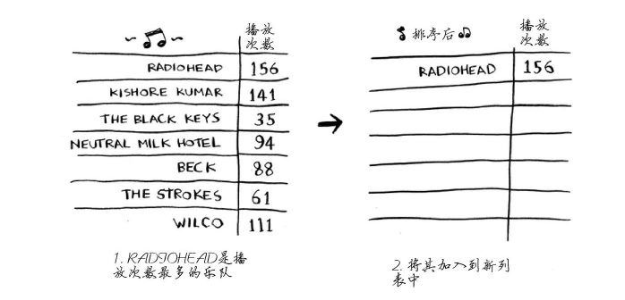
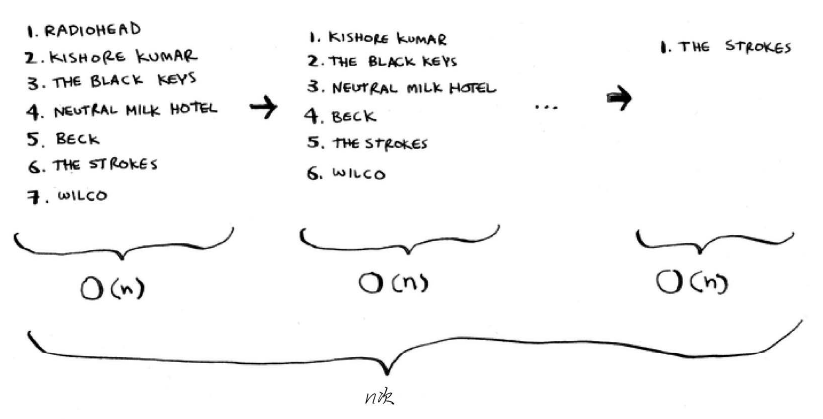
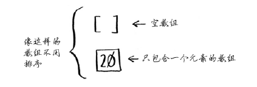
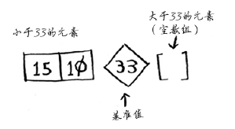

# 排序法

## 选择排序

假设你的计算机存储了很多乐曲。对于每个乐队，你都记录了其作品被播放的次数。你要将这个列表按播放次数从多到少的顺序排列，从而将你喜欢的乐队排序。该如何做呢？一种办法是遍历这个列表，找出作品播放次数最多的乐队，并将该乐队添加到一个新列表中。

<div align=center>



</div>

再次这样做，找出播放次数第二多的乐队。继续这样做，你将得到一个有序列表。

下面从计算机科学的角度出发，看看这需要多长时间。别忘了，O(n)时间意味着查看列表中的每个元素一次。例如，对乐队列表进行简单查找时，意味着每个乐队都要查看一次。要找出播放次数最多的乐队，必须检查列表中的每个元素。正如你刚才看到的，这需要的时间为O(n)。因此对于这种时间为O(n)的操作，你需要执行n次。

<div align=center>



</div>

需要的总时间为O(n × n)，即O(n^2)。

随着排序的进行，每次需要检查的元素数在逐渐减少，最后一次需要检查的元素都只有一个。既然如此，运行时间怎么还是O(n2 )呢？

你说得没错，并非每次都需要检查n个元素。第一次需要检查n个元素，但随后检查的元素数依次为n - 1, n – 2, …, 2和1。平均每次检查的元素数为1/2 × n，因此运行时间为O(n × 1/2 × n)。但大O表示法省略诸如1/2这样的常数，因此简单地写作O(n × n)或O(n2 )。

选择排序是一种灵巧的算法，但其速度不是很快。

```python
# 选择排序
def findSmallest(arr):
    smallest = arr[0]
    smallest_index = 0
    for i in range(1, len(arr)):
        if arr[i] < smallest:
            smallest = arr[i]
            smallest_index = i
    return smallest_index

def selectionSort(arr):
    newArr = []
    for i in range(len(arr)):
        smallest = findSmallest(arr)
        # pop() 函数用于移除列表中的一个元素（默认最后一个元素），并且返回该元素的值。
        newArr.append(arr.pop(smallest))
    return newArr

print selectionSort([5, 3, 6, 2, 10])

```

## 快速排序

快速排序是一种常用的排序算法，比选择排序快得多。例如，C语言标准库中的函qsort实现的就是快速排序。

下面来使用快速排序对数组进行排序。对排序算法来说，最简单的数组什么样呢？就是根本不需要排序的数组。

<div align=center>



</div>

因此，基线条件为数组为空或只包含一个元素。在这种情况下，只需原样返回数组——根本就不用排序。
```python
def quicksort(array):
    if len(array) < 2:
        return array
```
我们来看看更长的数组。首先，从数组中选择一个元素，这个元素被称为基准值（pivot）。我们暂时将数组的第一个元素用作基准值。接下来，找出比基准值小的元素以及比基准值大的元素。

<div align=center>



</div>
这被称为分区（partitioning）。现在你有：
1. 一个由所有小于基准值的数字组成的子数组；
2. 基准值；
3. 一个由所有大于基准值的数组组成的子数组。
这里只是进行了分区，得到的两个子数组是无序的。但如果这两个数组是有序的，对整个数组进行排序将非常容易。如果子数组是有序的，就可以像下面这样合并得到一个有序的数组：左边的数组+ 基准值+右边的数组。在这里，就是[10, 15] + [33] + []，结果为有序数组[10, 15, 33]。

如何对子数组进行排序呢？对于包含两个元素的数组（左边的子数组）以及空数组（右边的子数组），快速排序知道如何将它们排序，因此只要对这两个子数组进行快速排序，再合并结果，就能得到一个有序数组！
```python
quicksort([15, 10]) + [33] + quicksort([])
> [10, 15, 33]
```
不管将哪个元素用作基准值，这都管用。假设你将15用作基准值。

这个子数组都只有一个元素，而你知道如何对这些数组进行排序。现在你就知道如何对包含三个元素的数组进行排序了，步骤如下。
1. 选择基准值。
2. 将数组分成两个子数组：小于基准值的元素和大于基准值的元素。
3. 对这两个子数组进行快速排序。
同理，包含四个、五个、六个元素的数组。

```python
# 快速排序
def quicksort(array):
    if len(array) < 2:
        # 基线条件：为空或只包含一个元素的数组是“有序”的
        return array
    else:
        # 递归条件
        pivot = array[0]
        # 由所有小于基准线的元素组成的子数组
        less = [i for i in array[1:] if i <= pivot]
        # 由所有大于基准线的元素组成的子数组
        greater = [i for i in array[1:] if i > pivot]
        return quicksort(less) + [pivot] + quicksort(greater)
```
**快速排序在最糟糕的情况下，其运行时间为O(n^2), 在平均情况下，快速排序的运行时间为O(n log n)。**

## 未完