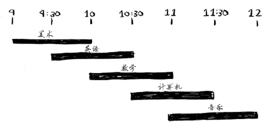

# 贪婪算法

## 教师调度问题

假设有如下课程表，你希望将尽可能多的课程安排在某间教室上。

你没法让这些课都在这间教室上，因为有些课的上课时间有冲突。

你希望在这间教室上尽可能多的课。如何选出尽可能多且时间不冲突的课程呢？
这个问题好像很难，不是吗？实际上，算法可能简单得让你大吃一惊。具体做法如下。
1. 选出结束最早的课，它就是要在这间教室上的第一堂课。
2. 接下来，必须选择第一堂课结束后才开始的课。同样，你选择结束最早的课，这将是要在这间教室上的第二堂课。

重复这样做就能找出答案！下面来试一试。美术课的结束时间最早，为10:00 a.m.，因此它就是第一堂课。

因此将在这间教室上如下三堂课。

这个算法太容易、太显而易见，肯定不对。但这正是贪婪算法的优点——简单易行！贪婪算法很简单：每步都采取最优的做法。在这个示例中，你每次都选择结束最早的课。用专业术语说，就是你每步都选择局部最优解，最终得到的就是全局最优解。信不信由你，对于这个调度问题，上述简单算法找到的就是最优解！

显然，贪婪算法并非在任何情况下都行之有效，但它易于实现！

## 未完