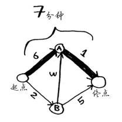

# 用狄克斯特拉算法计算带权最短路径

对于有向带权图中从一个确定顶点(称为源点)到其余各顶点的最短路径问题，狄克斯特拉(Dijkastra)提出了一个按路径长度递增的顺序逐步产生最短路径的构造算法。

## 狄克斯特拉算法思想

**[狄克斯特拉算法思想]** 设置两个顶点的集合 S 和 T ,集合 S 中存放已找到最短路径的顶点，集合 T 中存放当前还未找到最短路径的顶点。初始状态时，集合 S 中只包含源点，设为 v0 ,然后从集合 T 中选择到源点 v0 路径长度最短的顶点 u 加入到集合 S 中，集合 S 中每加入一个新的顶点 u ,都要修改源点 v0 到集合 T 中剩余顶点的当前最短路径长度值，集合 T 中各顶点的新的当前最短路径长度值为原来的当前最短路径长度值与从源点过顶点 u 到达该顶点的路径长度中的较小者。此过程不断重复，直到集合T中的顶点全部加入到集合 S 中为止。

对于下图所示的有向带权图给出了狄克斯特拉算法求从顶点A到其余各顶点的最短路径的过程。图中，虚线表示当前可选择的边，实线表示算法已确定包括到集合S中的顶点所对应的边。

<div align=center>

</div>

**Emm...懂..懂了吗？**

**好吧...反正我没看懂** ┑(￣Д ￣)┍

**让我们换一种打开方式**

## 举一个栗子：起点到终点

下面来看看如何对下面的图使用这种算法。

<div align=center>


</div>

其中每个数字表示的都是时间，单位分钟。为找出从起点到终点耗时最短的路径，你将使用狄克斯特拉算法。

如果你使用广度优先搜索，将得到下面这条段数最少的路径。

<div align=center>



</div>

这条路径耗时7分钟。下面来看看能否找到耗时更短的路径！狄克斯特拉算法包含4个步骤。
1. 找出“最便宜”的节点，即可在最短时间内到达的节点。
2. 更新该节点的邻居的开销，其含义将稍后介绍。
3. 重复这个过程，直到对图中的每个节点都这样做了。
4. 计算最终路径。

**第一步：** 找出最便宜的节点。你站在起点，不知道该前往节点A还是前往节点B。前往这两个节点都要多长时间呢？

<div align=center>


</div>

前往节点A需要6分钟，而前往节点B需要2分钟。至于前往其他节点，你还不知道需要多长时间。

<div align=center>


</div>

由于你还不知道前往终点需要多长时间，因此你假设为无穷大（这样做的原因你马上就会明白）。节点B是最近的——2分钟就能达到。

**第二步：** 计算经节点B前往其各个邻居所需的时间。

<div align=center>


</div>

你刚找到了一条前往节点A的更短路径！直接前往节点A需要6分钟。

<div align=center>


</div>

但经由节点B前往节点A只需5分钟！

<div align=center>


</div>

对于节点B的邻居，如果找到前往它的更短路径，就更新其开销。在这里，你找到了：
- 前往节点A的更短路径（时间从6分钟缩短到5分钟）
- 前往终点的更短路径（时间从无穷大缩短到7分钟）

**第三步：** 重复！

**重复第一步：** 找出可在最短时间内前往的节点。你对节点B执行了第二步，除节点B外，可在最短时间内前往的节点是节点A。

<div align=center>


</div>

**重复第二步：** 更新节点A的所有邻居的开销。

<div align=center>


</div>

你发现前往终点的时间为6分钟！

你对每个节点都运行了狄克斯特拉算法（无需对终点这样做）。现在，你知道：
- 前往节点B需要2分钟
- 前往节点A需要5分钟
- 前往终点需要6分钟
  
<div align=center>


</div>

最后一步——计算最终路径将留到下一节去介绍，这里先直接将最终路径告诉你。

<div align=center>


</div>

如果使用广度优先搜索，找到的最短路径将不是这条，因为这条路径包含3段，而有一条从起点到终点的路径只有两段。

<div align=center>


</div>

你使用了广度优先搜索来查找两点之间的最短路径，那时“最短路径”的意思是段数最少。在狄克斯特拉算法中，你给每段都分配了一个数字或权重，因此狄克斯特拉算法找出的是总权重最小的路径。

<div align=center>


</div>

这里重述一下，狄克斯特拉算法包含4个步骤。

1. 找出最便宜的节点，即可在最短时间内前往的节点。
2. 对于该节点的邻居，检查是否有前往它们的更短路径，如果有，就更新其开销。
3. 重复这个过程，直到对图中的每个节点都这样做了。
4. 计算最终路径。（后面讲）

## 举二个栗子：换钢琴

我们再来看一个例子！这是Rama，想拿一本乐谱换架钢琴。

Alex说：“这是我最喜欢的乐队Destroyer的海报，我愿意拿它换你的乐谱。如果你再加5美元，还可拿乐谱换我这张稀有的Rick Astley黑胶唱片。”Amy说：“哇，我听说这张黑胶唱片里有首非常好听的歌曲，我愿意拿我的吉他或架子鼓换这张海报或黑胶唱片。”

Beethoven惊呼：“我一直想要吉他，我愿意拿我的钢琴换Amy的吉他或架子鼓。”

太好了！只要再花一点点钱，Rama就能拿乐谱换架钢琴。现在他需要确定的是，如何花最少的钱实现这个目标。我们来绘制一个图，列出大家的交换意愿。

<div align=center>

</div>

这个图中的节点是大家愿意拿出来交换的东西，边的权重是交换时需要额外加多少钱。拿海报换吉他需要额外加30美元，拿黑胶唱片换吉他需要额外加15美元。Rama需要确定采用哪种路径将乐谱换成钢琴时需要支付的额外费用最少。为此，可以使用狄克斯特拉算法！别忘了，狄克斯特拉算法包含四个步骤。在这个示例中，你将完成所有这些步骤，因此你也将计算最终路径。

动手之前，你需要做些准备工作：创建一个表格，在其中列出每个节点的开销。这里的开销指的是达到节点需要额外支付多少钱。

在执行狄克斯特拉算法的过程中，你将不断更新这个表。为计算最终路径，还需在这个表中添加表示父节点的列。

这列的作用将稍后介绍。我们开始执行算法吧。

**第一步：** 找出最便宜的节点。在这里，换海报最便宜，不需要支付额外的费用。还有更便宜的换海报的途径吗？这一点非常重要，你一定要想一想。Rama能够通过一系列交换得到海报，还能额外得到钱吗？想清楚后接着往下读。答案是不能，因为海报是Rama能够到达的最便宜的节点，没法再便宜了。

所以，可以列出从乐谱出发的路径。

<<div align=center>>

</div>

**第二步：** 计算前往该节点的各个邻居的开销。

我们从最便宜的海报结点开始，计算海报结点到其邻居结点的路径。

现在的表中包含低音吉他和架子鼓的开销。这些开销是用海报交换它们时需要支付的额外费用，因此父节点为海报。这意味着，要到达低音吉他，需要沿从海报出发的边前行，对架子鼓来说亦如此。

<<div align=center>>

</div>

**再次执行第一步：** 下一个最便宜的节点是黑胶唱片——需要额外支付5美元。

**再次执行第二步：** 更新黑胶唱片的各个邻居的开销。

<<div align=center>>

</div>

你更新了架子鼓和吉他的开销！这意味着经“黑胶唱片”前往“架子鼓”和“吉他”的开销更低，因此你将这些乐器的父节点改为黑胶唱片。

我们继续！表中下一个最便宜的是吉他，因此更新其邻居的开销。

<<div align=center>>

</div>

你终于计算出了用吉他换钢琴的开销，于是你将其父节点设置为吉他。最后，对最后一个节点——架子鼓，做同样的处理。

<<div align=center>>

</div>

哈！用架子鼓换钢琴的开销更小哦。

如果用架子鼓换钢琴，Rama需要额外支付的费用更少。因此，采用最便宜的交换路径时，Rama需要额外支付35美元。

现在来兑现前面的承诺，确定最终的路径。当前，我们知道最短路径的开销为35美元，但如何确定这条路径呢？

<<div align=center>>

</div>

出现了！最短路线怪(误～)

最终Rama需要做的一系列交换：乐谱 -> 唱片 -> 架子鼓 -> 钢琴。

这都要归功于狄克斯特拉！

##　Warning

我们的几个栗子的共同点都是：没有负权边！

这是因为狄克斯特拉算法这样假设：对于处理过的海报节点，没有前往该节点的更短路径。

这种假设仅在没有负权边时才成立。因此，**不能将狄克斯特拉算法用于包含负权边的图**。在包含负权边的图中，要找出最短路径，可使用另一种算法——贝尔曼·福德算法（Bellman-Fordalgorithm）。

## 代码代码代码

### python实现

```python

graph = {}
graph["start"] = {}
graph["start"]["a"] = 6
graph["start"]["b"] = 2

graph["a"] = {}
graph["a"]["fin"] = 1
graph["b"] = {}
graph["b"]["a"] = 3
graph["b"]["fin"] = 5
graph["fin"] = {}

infinity = float("inf")
costs = {}
costs["a"] = 6
costs["b"] = 2
costs["fin"] = infinity

parents = {}
parents["a"] = "start"
parents["b"] = "start"
parents["fin"] = None

processed = []

def find_lowest_cost_node(costs):
    # 正无穷：float("inf"); 负无穷：float("-inf")
    lowest_cost = float("inf")
    lowest_cost_node = None
    for node in costs:
        cost = costs[node]
        if cost < lowest_cost and node not in processed:
            lowest_cost = cost
            lowest_cost_node = node
    return lowest_cost_node

node = find_lowest_cost_node(costs)
while node is not None:
    cost = costs[node]
    neighbors = graph[node]
    for n in neighbors.keys():
        new_cost = cost + neighbors[n]
        if costs[n] > new_cost:
            costs[n] = new_cost
            parents[n] = node   
    processed.append(node)
    node = find_lowest_cost_node(costs)

```

### Ｃ

```c
//　好长啊，不想打了。
```

### JAVA

```java
// 略
```

## 图文来源

1. 《算法图解》 Aditya Bhargava著 袁国忠译
2. 《数据结构》 电子工业出版社 朱战立编著
3. 我的电脑
4. 我的双手
5. 我的脑子