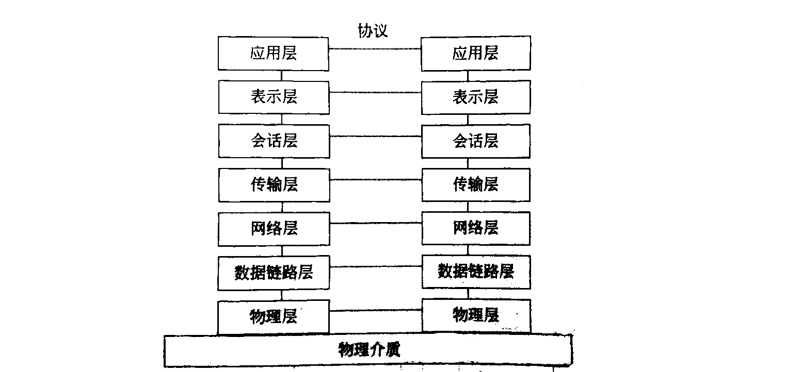
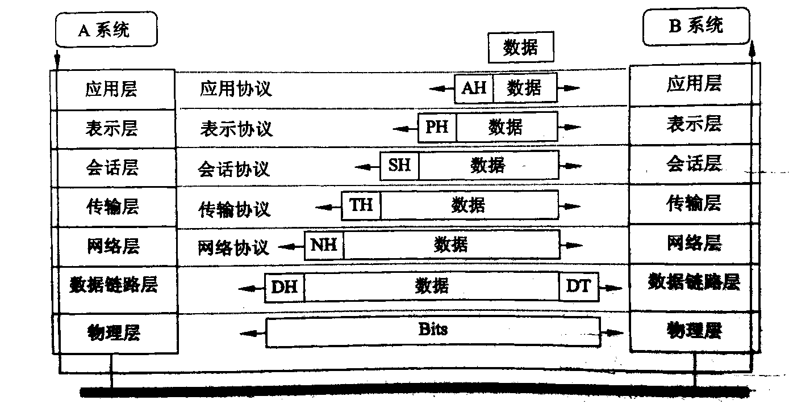

# ISO/OSI 网络体系结构

>计算机网络是相当复杂的系统，相互通信的两个计算机系统必须高度协调才能正常工作。为了设计这样复杂的计算机网络，人们提出了将网络分层的方法。分层可将庞大而复杂的问题转化为若干较小的局部问题进行处理，从而使问题简单化。
>
>国际标准化组织在1977年成立了-一个分委员会专门研究网络通信的体系结构问题，并提出了开放系统互连参考模型，它是- -个定义异种计算机连接标准的框架结构。OSI 为连接分布式应用处理的“开放”系统提供了基础。所谓“开放"，是指任何两个系统只要遵守参考模型和有关标准就能够进行互连。OSI 采用了层次化结构的构造技术。
>
>ISO分委员会的任务是定义一组层次和每一层所完成的功能和服务。层次的划分应当从逻辑上将功能分组，层次应该足够多，应使每一层小到易于管理的程度，但也不能太多，否则汇集各层的处理开销太大。

## ISO/OSI参考模型

ISO/OSI的参考模型共有7层，如图10-3所示。由低层至高层分别为物理层、数据链路层、网络层、传输层、会话层、表示层和应用层。

OSI 参考模型OSI参考模型具有以下特性。

1. 它是种将异构系统互连的分层结构。
2. 提供了控制互连系统交互规则的标准框架。
3. 定义了一种抽象结构，而并非具体实现的描述。
4. 不同系统上相同层的实体称为同等层实体。
5. 同等层实体之间的通信由该层的协议管理。
6. 相邻层间的接口定义了原语操作和低层向高层提供的服务。
7. 所提供的公共服务是面向连接的或无连接的数据服务。
8. 直接的数据传送仅在最低层实现。
9. 每层完成所定义的功能，修改本层的功能并不影响其他层，

**OSI/RM中的1-3层主要负责通信功能，一般称为通信子网层。 上三层(即5-7层)属于资源子网的功能范時，称为资源子网层。传输层起着衔接上、下三层的作用。**

### 物理层(Physical Layer)

物理层提供为建立、维护和拆除物理链路所需的机械、电气、功能和规程的特性;提供有关在传输介质上传输非结构的位流及物理链路故障检测指示。

用户要传递信息就要利用些物理媒体， 如双绞线、同轴电缆等，但具体的物理媒体并不在OSI的7层之内，有人把物理媒体当作第0层，物理层的任务就是为它的上一层提供个物理连接，以及它们的机械、电气、功能和过程特性。例如规定使用电缆和接头的类型，传送信号的电压等。**在这层，数据还没有被组织，仅作为原始的位流或电气电压处理，单位是位。**

### 数据链路层(Data Link Layer)

数据链路层负责在两个相邻结点间的线路上无差错地传送**以帧为单位**的数据，并进行流量控制。每帧包括一定数量的数据和一些必要的控制信息。和物理层相似，数据链路层要负责建立、维持和释放数据链路的连接。在传送数据时，如果接收点检测到所传数据中有差错，就要通知发送方重发这一帧。

### 网络层(Network Layer)

网络层为传输层实体提供端到端的交换网络数据功能，使得传输层摆脱路由选择、交换方式和拥挤控制等网络传输细节;可以为传输层实体建立、维持和拆除一条或多条通信路径;对网络传输中发生的不可恢复的差错予以报告。

在计算机网络中进行通信的两个计算机之间可能会经过很多个数据链路，也可能还要经过很多通信子网。网络层的任务就是选择合适的网间路由和交换结点，确保数据及时传送。**网络层将数据链路层提供的帧组成数据包**，包中封装有网络层包头，其中含有逻辑地址信息，即源站点和目的站点的网络地址。

### 传输层(Transport Layer)

传输层为会话层实体提供透明、可靠的数据传输服务，保证端到端的数据完整性；选择网络层能提供最适宜的服务提供建立、维护和拆除传输连接功能。传输层根据通信子网的特性最佳地利用网络资源，为两个端系统（也就是源站和目的站）的会话层之间提供建立、维护和取消传输连接的功能，并以可能和经济的方式传输数据。在这一层，**信息的传送单位是报文。**

### 会话层(Session Layer)

会话层为彼此合作的表示层实体提供建立、维护和结束会话连接的功能:完成通信进程的逻辑名字与物理名字间的对应提供会话管理服务。

这一层也可以称为会话层或对话层，**在会话层及以上的高层中，数据传送的单位不再另外命名，统称为报文**。会话层不参与具体的传输，它提供包括访问验证和会话管理在内的建立和维护应用之间通信的机制。例如服务器验证用户登录便是由会话层完成的。

### 表示层(Presentation Layer)

表示层为应用层进程提供能解释所交换信息含义的一组服务，即将要交换的数据从适合于某一用户的抽象语法转换为适合于OSI系统内部使用的传送语法;提供格式化的表示和转换数据服务。数据的压缩、解压缩、加密和解密等工作都由表示层负责。

### 应用层(Application Layer)

应用层提供OSI用户服务，即确定进程之间通信的性质，以满足用户需要以及提供网络与用户应用软件之间的接口服务。例如，事务处理程序、电子邮件和网络管理程序等。

## 参考模型的信息流向

如图所示，设A系统的用户要向B系统的用户传送数据。

- A系统用户的数据先送入应用层，该层给它附加控制信息AH(头标)后，送入表示层。
- 表示层对数据进行必要的变换并加头标PH后送入会话层。会话层也加头标SH送入传输层。
- 传输层将长报文分段后并加头标TH送至网络层。网络层将信息变成报文分组，并加组号NH送数据链路层。
- 数据链路层将信息加上头标和尾标(DH 及DT)变成帧，经物理层按位发送到对方(B系统)。
  
B系统接收到信息后，按照与A系统相反的动作，层层剥去控制信息，最后把原数据传送给B系统的用户。可见，两系统中只有物理层是实通信，其余各层均为虚通信。因此，图中只有两物理层之间有物理连接，其余各层间均无连线。