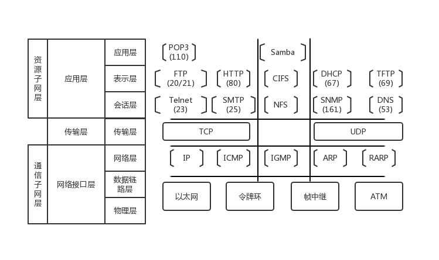

# TCP/IP 协议族

TCP/IP作为Internet的核心协议，通过近20多年的发展已日渐成熟，并被广泛应用于局域网和广域网中，目前已成为事实上的国际标准。作为一个最早的、也是迄今为止发展最为成熟的互连网络协议系统，TCP/IP 包含许多重要的基本特性，这些特性主要表现在5个方面:逻辑编址、路由选择、域名解析、错误检测和流量控制以及对应用程序的支持等。

1. 逻辑编址。每一块网卡在出厂时就由厂家分配了一个独一无二的永久性的物理地址。在Internet中，为每台连入因特网的计算机分配一个逻辑地址，这个逻辑地址被称为IP地址。一个IP地址可以包括一个网络ID号，用来标识网络; 一个子网络ID号，用来标识网络上的一个子网；另外，还有一个主机ID号，用来标识子网络上的一台计算机。这样，通过这个分配给某台计算机的IP地址，就可以很快地找到相应的计算机。

2. 路由选择。在TCP/IP中包含了专门用于定义路由器如何选择网络路径的协议，即IP数据包的路由选择。

3. 域名解析。虽然TCP/IP采用的是32位的IP地址，但考虑到用户记忆方便，专门设计了一种方便的字母式地址结构，称为域名或DNS(域名服务)名字。将域名映射为IP地址的操作称为域名解析。域名具有较稳定的特点，而IP地址较易发生变化。

4. 错误检测和流量控制。TCP/IP具有分组交换确保数据信息在网络上可靠传递的特性，这些特性包括检测数据信息的传输错误(保证到达目的地的数据信息没有发生变化)，确认已传递的数据信息已被成功地接收，监测网络系统中的信息流量，防止出现网络拥塞。

---

## TCP/IP分层模型

协议是对数据在计算机或设备之间传输时的表示方法进行定义和描述的标准。协议规定了进行传输、检测错误以及传送确认信息等内容。TCP/IP是个协议族，它包含了多种协议。ISO/OSI模型、TCP/IP的分层模型及协议的对比如下图，括号内为其端口号。

从图中可知，TCP/IP分层模型由4个层次构成，即应用层、传输层、网际层和网络接口层，对各层的功能简述如下。

1. 应用层。应用层处在分层模型的最高层，用户调用应用程序来访问TCP/IP互连网络，以享受网络上提供的各种服务。应用程序负责发送和接收数据。每个应用程序可以选择所需要的传输服务类型，并把数据按照传输层的要求组织好，再向下层传送，包括独立的报文序列和连续字节流两种类型。

2. 传输层。传输层的基本任务是提供应用程序之间的通信服务，这种通信又称端到端的通信。传输层既要系统地管理数据信息的流动，还要提供可靠的传输服务，以确保数据准确而有序地到达目的地。为了这个目的，传输层协议软件需要进行协商，让接收方回送确认信息及让发送方重发丢失的分组。在传输层与网际层之间传递的对象是传输层分组。

3. 网际层。网际层又称IP层，主要处理机器之间的通信问题。它接收传输层请求，传送某个具有目的地址信息的分组。该层主要完成以下功能。
   1. 把分组封装到IP数据报(IP Dagmn)中，填入数据报的首部(也称为报头)，使用路由算法选择把数据报直接送到目标机或把数据报发发送给路由器，然后再把数据报交给下面的网络接口层中对应的网络接口模块。
   2. 处理接收到的数据报，检验其正确性。使用路由算法来决定是在本地进行处理，还是继续向前发送。如果数据报的目标机处于本机所在的网络，该层软件就把数据报的报头剥去，再选择适当的传输层协议软件来处理这个分组。
   3. 适时发出ICMP的差错和控制报文，并处理收到的ICMP报文。

4. 网络接口层，网络接口层又称数据链路层，处于TCP/IP协议层之下，负责接收IP数据报，并把数据报通过选定的网络发送出去。该层包含设备驱动程序，也可能是一个复杂的、使用自己的数据链路协议的子系统。

---

## 网络接口层协议

TCP/IP协议不包含具体的物理层和数据链路层，只定义了网络接口层作为物理层与网络层的接口规范。这个物理层可以是广域网，例如X.25公用数据网，也可以是局域网，例如Ethernet、Token-Ring和FDDI等。任何物理网络只要按照这个接口规范开发网络接口驱动程序，就能够与TCP/IP协议集成起来。网络接口层处在TCP/IP协议的最底层，主要负责管理为物理网络准备数据所需的全部服务程序和功能。

---

## 网际层协议——IP

网际层是整个TCP/IP协议族的重点。在网际层定义的协议除了IP外，还有ICMP、ARP和RARP等几个重要的协议。

IP所提供的服务通常被认为是无连接的(Connectionless)和不可靠的(Unreliable)。事实上，在网络性能良好的情况下，IP传送的数据能够完好无损地到达目的地。所谓无连接的传输，是指没有确定目标系统在已做好接收数据准备之前就发送数据。与此相对应的就是面向连接的(Connection Oriented)传输(如TCP),在该类传输中，源系统与目的系统在应用层数据传送之前需要进行三次握手。至于不可靠的服务，是指目的系统不对成功接收的分组进行确认，IP只是尽可能地使数据传输成功。但是只要需要，上层协议必须实现用于保证分组成功提供的附加服务。

由于IP只提供无连接、不可靠的服务，所以把差错检测和流量控制之类的服务投权给了其他的各层协议，这正是TCP/P能够高效工作的一个重要保证。这样，可以根据传送数据的属性来确定所需的传送服务以及客户应该使用的协议。例如，传送大型文件的FTP会话需要面向连接的、可靠的服务(因为如果稍有损坏，就可能导致整个文件无法使用)。

IP的主要功能包括将上层数据(如TCP、UDP数据)或同层的其他数据(如ICMP数据)封装到IP数据报中；将IP数据报传送到最终目的地，为了使数据能够在链路层上进行传输，对数据进行分段；确定数据报到达其他网络中的目的地的路径。

    IP协议软件及工作流程：当发送数据时，源计算机上的IP协议软件必须确定目的地是在同个网络上，还是在另一个网络上，IP通过执行这两项计算并对结果进行比较，才能确定数据到达的目的地。如果两项计算的结果果相同，则数据的目的地确定为本地；否则，目的地应为远程的其他网络。如果目的地在本地，那么IP协议软件就启动直达通信；如果目的地是远程计算机，那么IP必须通过网关(或路由器)进行通信，在大多数情况下，这个网关应当是默认网关。当源IP完成了数据报的准备工作时，它就将数据报传递给网络访问层，网络访问层再将数据报传送给传输介质，最终完成数据帧发往目的计算机的过程。

当数据抵达目的计算机时，网络方问层首先接收该数据。网络访问层要检查数据帧有无错误，并将数据帧送往正确的物理地址。假如数据帧到达目的地时正确无误，网络访问层便从数据帧的其余部分中提取数据有效负载(Peyload),然后将它一直传送到帧层次类型域指定的协议。在这种情况下，可以说数据有效负载已经传递给了IP。

---

## ARP和RARP

地址解析协议(Address Resolution Protocol, ARP)及反地址解析协议(RARP)是驻留在网际层中的另一个重要协议。ARP的作用是将IP地址转换为物理地址，RARP的作用是将物理地址转换为IP地址。网络中的任何设备，主机、路由器和交换机等均有唯的物理地址，该地址通过网卡给出，每个网卡出厂后都有不同的编号，这意味着用户所购买的网卡有着唯一的物理地址。另一方面，为了屏蔽底层协议及物理地址上的差异，IP协议又使用了IP地址，因此，在数据传输过程中，必须对IP地址与物理地址进行相互转换。

    用ARP进行IP地址到物理地址转换的过程为:当计算机需要与任何其他的计算机进行通信时，首先需要查询ARP高速缓存，如果ARP高速缓存中这个IP地址存在，便使用与它对应的物理地址直接将数据报发送给所需的物理网卡；如果ARP高速缓存中没有该IP地址，那么ARP便在局城网上以广播方式发送一个ARP请求包。如果局城网上IP地址与某台计算机中的IP地址相致，那么该计算机便生成一个ARP应答信息，信息中包含对应的物理地址。ARP协议软件将IP地址与物理地址的组合添加到它的高速缓存中，这时即可开始数据通信。

RARP负责物理地址到IP地址的转换，这主要用于无盘工作站。网络上的无盘工作站在网卡上有自己的物理地址，但无IP地址，因此必须有一个转换过程。为了完成这个转换过程，网络中有一个RARP服务器，网络管理员事先必须把网卡上的IP地址和相应的物理地址存储到IP RARP服务器的数据库中。

---

## 网际层协议——ICMP

Internet控制信息协议(Internet Control Message Protocol, ICMP)是网际层的另一个比较重要的协议。由于IP是一种尽力传送的通信协议，即传送的数据报可能丢失、重复、延迟或乱序，因此P需要种避免差错并在发生差错时报告的机制。ICMP就是一个专门用于发送差错报文的协议。ICMP定义了5种差错报文(源抑制、超时、目的不可达、重定向和要求分段)和4种信息报文(回应请求、回应应答、地址屏蔽码请求和地址屏蔽码应答)。IP在需要发送一个差错报文时要使用ICMP，而ICMP也是利用IP来传送报文的。ICMP是让IP更加稳固、有效的一种协议，它使得IP传送机制变得更加可靠。而且ICMP还可以用于测试因特网，以得到一些有用的网络维护和排错的信息。例如，著名的ping工具就是利用ICMP报文进行目标是否可达测试。

---

## 传输层协议——TCP

TCP (Transmission Control Protocol, 传输控制协议)是整个TCP/IP协议族中最重要的协议之一。它在IP提供的不可靠数据服务的基础上为应用程序提供了一个可靠的、面向连接的、全双工的数据传输服务。

TCP是如何实现可靠性的呢?最主要和最重要的是TCP采用了重发(Retransmission) 技术。具体来说，在TCP传输过程中，发送方启动一个定时器，然后将数据包发出，当接收方收到了这个信息时就给发送方一个确认(Acknowledgement) 信息。如果发送方在定时器到点之前没有收到这个确认信息，就重新发送这个数据包。

利用TCP在源主机和目的主机之间建立和关闭连接操作时，均需要通过三次握手来确认建立和关闭是否成功。它通过“序号确认号”使得系统正常工作，从而使它们的序号达成同步。TCP建立连接的三次握手过程如下。

1. 源主机发送一个SYN (同步)标志位为1的TCP数据包，表示想与目标主机进行通信并发送一个同步序列号(如SEQ=200)进行同步。

2. 目标主机同意进行通信，则响应一个确认(ACK位置1)，井以下个序列号为参考(如201)

3. 源主机以确认来响应目标主机的ICP包，这个确认中包括它想要接收的下一个序列号(该帧可以含有发送的数据)。至此连接建立完成。

同样，关闭连接也进行三次握手。

---

## 传输层协议——UDP

用户数据报协议(User Datagram Protocol UDP) 是一种不可靠的、无连接的协议，可以保证应用程序进程间的通信。与同样处在传输层的面向连接的TCP相比，UDP是种无连接的协议，它的错误检测功能要弱得多。可以这样说，TCP 有助于提供可靠性；而UDP有助于提高传输的高速率性。例如，必须支持交互式会话的应用程序(如FTP等)往往使用TCP；而自己进行错误检测或不需要错误检测的应用程序(如DNS、SNMP等)往往使用UDP。

UDP协议软件的主要作用是将UDP消息展示给应用层，它并不负责重新发送丢失的或出错的数据消息，不对接收到的无序IP数据报重新排序，不消除重复的IP数据报，不对已收到的数据报进行确认，也不负责建立或终止连接。这些问题是由使用UDP进行通信的应用程序负责处理的。

TCP虽然提供了一个可靠的数据传输服务，但它是以牺牲通信量来实现的。也就是说，为了完成同样一个任务，TCP需要更多的时间和通信量。这在网络不可靠的时候通过牺牲一些时间换来达到网络的可靠性是可行的，但在网络十分可靠的情况下，则可以采用UDP,通信量的浪费就会很小。

## 应用层协议

随着计算机网络的广泛应用，人们也已经有了许多基本的、相同的应用需求。为了让不同平台的计算机能够通过计算机网络获得些基本的、 相同的服务，也就应运而生了一系列应用级的标准，实现这些应用标准的专用协议被称为应用级协议，相对于OSI参考模型来说，它们处于较高的层次，所以也称为高层协议。应用层的协议有NFS、Telnet、 SMTP、DNS、 SNMP和FIP等。